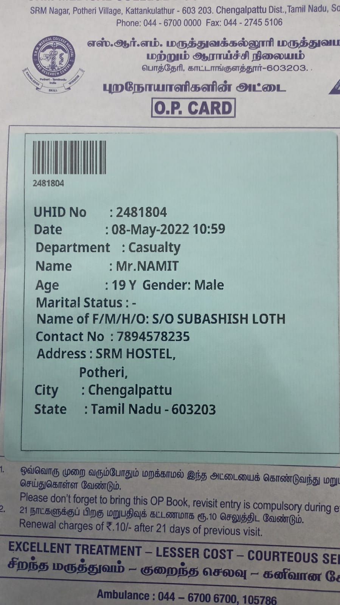
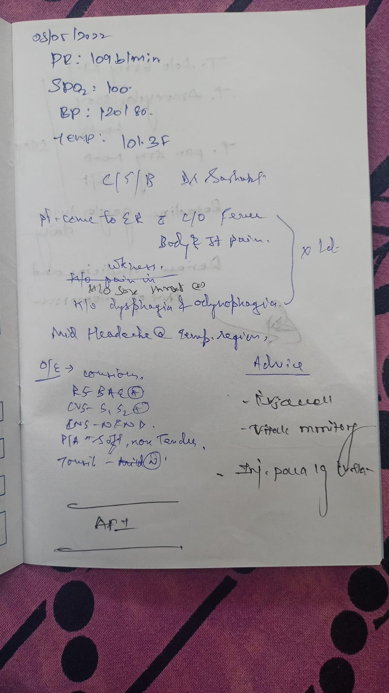
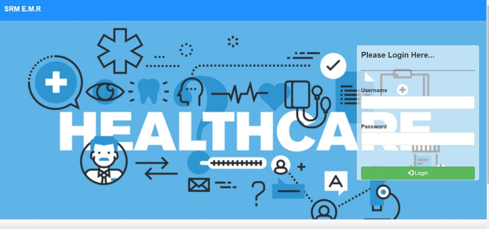
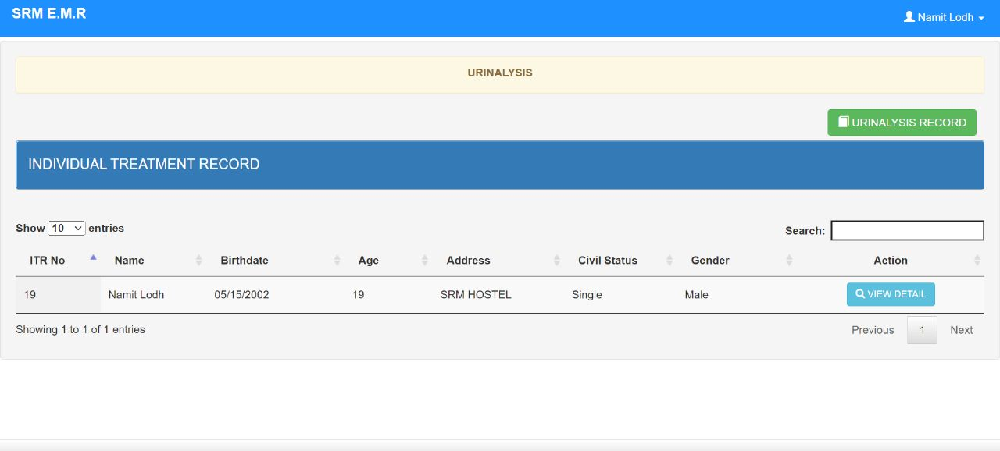

# 2_broke_codes

This is a submission for day 3 Emids Healthcare Hackathon

We had chosen problem statement 1 (Light emr)

## Introduction
EHR or(Electronic Health Records) is a record is the systematized collection of patient and population electronically stored health information in a digital format.
This is done using an EMR which is mostly used by hospitals.

The problem that comes with EMR's in India is that they are all decentrallized ie No one is connected to another
each patients data is stored in different hospitals in different places ie(There is no sytem). There is now way of a patient to access their data fromtheir comfort of their hand in the 21st century.

## Our approach
Our approach is to start small 
Our solution implementation to this problem was to create a simple EMR for the students of our college SRMIST Chennai 
where we only have one hospital in the outskirts of the main city.

Where patient info is usually given in a blue booklet which is often damed or is lodt by the student.
He/she is not able to access thir data nor are they able to add their lab reports from other labs/hospitals back home

Given an example of the booklet

  

## Given the short time and our low resources for this hackathon we were not able to implement handwritten to text using a cnn deep learning model our application is only based on tect data which it can capture or is given as a png of a lab report.

### Step 1:(Signing in using login id and password)

Our application will be based on a unique id which is the uhid in our case which can be converted into a KYC format in the future 
It is a standard login page aceesable to both user and hospital staff.

### Step 2:(Scanning the document)
We are using opencv library to get an image of the file to be scanned our scanned image is stored in the same directory.

The user for now has to run the scanner.py file to run the code.
The webcam should open up and should we can take an image using the spacebar key and escape using the escape key
the final image is stored and will be used for further analysis

(inser ss here)

### Step 3:(Getting Text from image)
Once we have got the image from the scaner we have used the tensorflow library which is an open source library 
Using tensor flow we are able to extract the important information given in the op cards like uhid ,name ,age , sex etc

the extracted information will be stored in the students dataset in the future application of this project.
where the student will be able to access his or her data like when did he visit who was the doctor and what was his diagnosis.

(INSERT SS HERE)

### Step 4 (Taking the data to output)

The next step involves taking the extracted data asd adding it to a unique student databse which shall be acessable only to the student and hospital staff.

As shown below in the image our data set has been formed for patient namit and his data is stored as given below.

## Installation guide: 📖
After cloning the repo or copying the code, run the following commands on your *command promt* before running the code.

`pip install opencv`

`pip install tesseract`

## Future changes 👓
1. Develop a proper webpage 
2. Index through multiple pages
3. Better way of displaying the results
4. Using CNN model to train and test to convert handwritten images to text
5. Creating a mobile application of the same so that it is acessable
6. 

### Language used 👩‍💻
[python](https://www.python.org/)
[HTML](https://www.w3schools.com/html/)

### Libraries used 📚
1. [Pytesseract](https://github.com/UB-Mannheim/tesseract/wiki)
2. [opencv](https://sourceforge.net/projects/opencvlibrary/)
3. [Pillow](https://pillow.readthedocs.io/en/stable/)

### Team Members 🧑
1. [Yashas Dewan](https://github.com/yd776)
2. [Omisha Singal](https://github.com/omi-sha)
3. [Utkarsh Singh ](https://github.com/Ut03)
